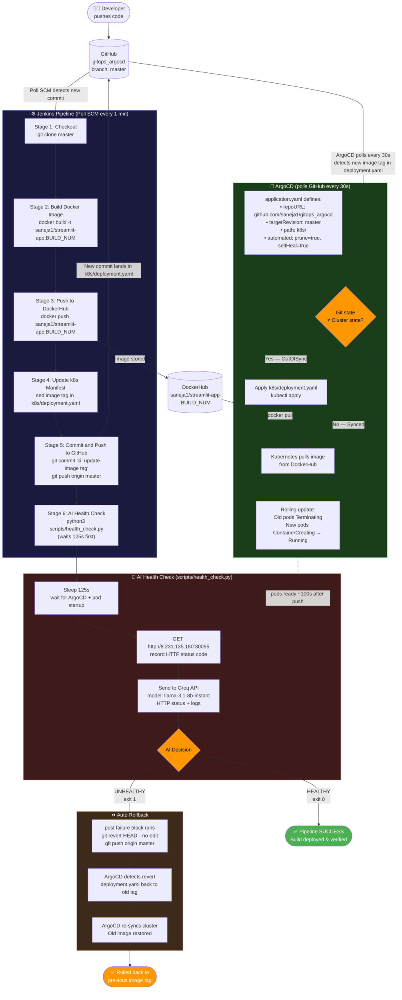

# GitOps with ArgoCD — Portfolio Project

A complete GitOps CI/CD pipeline using Jenkins, ArgoCD, Docker, and Kubernetes on Google Cloud VMs.

---

## Project Summary

This project solves a real-world problem: **how do you deploy code changes to a Kubernetes cluster reliably, automatically, and safely — without anyone manually running kubectl commands?**

### What it does
A developer pushes a code change to GitHub. From that point, everything is fully automated:
- **Jenkins** detects the change (Poll SCM), builds a new Docker image, pushes it to DockerHub, and updates the image tag in the Kubernetes deployment manifest in Git
- **ArgoCD** watches the Git repo and detects the manifest change within 30 seconds, then applies it to the Kubernetes cluster automatically
- **New pods** start with the updated image, old pods are terminated, and the app is live — no human intervention required

### How it helps
| Problem | How this project solves it |
|---|---|
| Manual deployments are error-prone | Everything after `git push` is automated |
| Hard to know what's running in production | Git is the single source of truth — what's in `k8s/` is what runs |
| Cluster drift (someone manually changes something) | ArgoCD `selfHeal` reverts any manual changes back to Git state |
| Accidental leftover resources | ArgoCD `prune` removes resources that are deleted from Git |
| No audit trail | Every deployment is a Git commit — full history of what was deployed and when |

### Infrastructure
- **App:** Streamlit (Python web app) running on Kubernetes
- **Cluster:** Self-managed Kubernetes on a GCP VM (`k8s-master-01`, IP: `8.231.135.180`)
- **Live URL:** `http://8.231.135.180:30095`

---

## What is ArgoCD?

ArgoCD is a **continuous delivery tool** that runs inside your Kubernetes cluster and automatically keeps the cluster in sync with a Git repository.

### How it operates

ArgoCD works on a simple loop:

```
1. Watch a Git repo (e.g. the k8s/ folder)
2. Compare what's in Git (desired state) with what's running in the cluster (actual state)
3. If they differ → apply Git state to the cluster
4. Repeat every 30 seconds (configurable)
```

It runs as a set of pods inside the `argocd` namespace in your cluster. The key component is the **argocd-application-controller** — it continuously reconciles the cluster state against Git.

### Key concepts

| Concept | What it means |
|---|---|
| **Application** | An ArgoCD resource that defines what repo/folder to watch and where to deploy |
| **Sync** | The act of applying Git state to the cluster |
| **Desired state** | What the YAML files in Git say should be running |
| **Actual state** | What is actually running in the cluster right now |
| **Drift** | When actual state doesn't match desired state |
| **selfHeal** | ArgoCD automatically fixes drift by re-applying Git state |
| **prune** | ArgoCD deletes cluster resources that no longer exist in Git |

### How ArgoCD helps

- **No manual `kubectl apply`** — you push to Git, ArgoCD handles the rest
- **Cluster always matches Git** — anyone can see the exact state of production just by reading the repo
- **Automatic recovery** — if someone manually changes something in the cluster, ArgoCD reverts it
- **Audit trail** — every change is a Git commit with author, timestamp, and message
- **Multi-environment support** — one ArgoCD can watch multiple repos/folders and deploy to multiple namespaces or clusters
- **Self-healing** — if a pod crashes and the deployment is deleted manually, ArgoCD recreates it from Git

### ArgoCD vs traditional Jenkins-only CD

| | Traditional (Jenkins does everything) | GitOps with ArgoCD |
|---|---|---|
| Who deploys? | Jenkins runs `kubectl apply` | ArgoCD watches Git and applies |
| Source of truth | Jenkins job config | Git repo |
| Manual kubectl change | Persists silently | ArgoCD reverts it within 30s |
| Rollback | Re-run old Jenkins job | `git revert` + push |
| Audit | Jenkins build logs | Git commit history |

---

## What is GitOps?

GitOps is a way of doing deployments where Git is the single source of truth for what runs in production.

- Your Kubernetes manifests live in a Git repo
- A tool (ArgoCD) runs inside your cluster and continuously watches that repo
- Whenever the repo changes, ArgoCD automatically applies those changes to the cluster
- The cluster always reflects exactly what is in Git

**Key difference from traditional CI/CD:**
In a standard Jenkins pipeline, Jenkins builds the image AND runs `kubectl apply` directly against the cluster. In GitOps, Jenkins only builds and updates a Git file. ArgoCD (running inside the cluster) handles the actual deployment by pulling from Git.

---

## Architecture Diagram


## Architecture

```
Developer pushes code
        ↓
GitHub (stores app code + k8s manifests)
        ↓
Jenkins CI (builds Docker image, pushes to DockerHub, updates image tag in k8s/, commits back to GitHub)
        ↓
ArgoCD (watches k8s/ folder in GitHub, detects change, applies manifests to cluster)
        ↓
Kubernetes Cluster (runs the updated pods)
        ↓
End User (accesses app via NodePort)
```

**Why two separate concerns (CI and CD)?**
- Jenkins never touches the Kubernetes cluster directly — it only talks to Git and DockerHub
- ArgoCD never builds images — it only watches Git and applies manifests
- This separation makes each part easier to debug, audit, and secure

---

## Project Structure

```
gitops_argocd/
├── .gitignore              # ignores venv/, __pycache__, .env
├── Jenkinsfile             # CI pipeline (build, push, update tag, commit)
├── app/
│   ├── app.py              # Streamlit application
│   ├── requirements.txt    # Python dependencies
│   └── Dockerfile          # packages the app into a Docker image
├── k8s/
│   ├── namespace.yaml      # creates the streamlit-app namespace
│   ├── deployment.yaml     # tells Kubernetes which image to run and how many pods
│   └── service.yaml        # exposes the app via NodePort on port 30095
└── argocd/
    └── application.yaml    # tells ArgoCD which repo/folder to watch and where to deploy
```

**Why two folders (app/ and k8s/)?**
- `app/` changes when a developer updates the application code
- `k8s/` changes only when the deployment state needs to change (e.g. new image tag)
- ArgoCD watches only `k8s/` — it doesn't care about Python files
- Jenkins updates only `k8s/deployment.yaml` after each build

---

## Tech Stack

| Tool | Role |
|---|---|
| Streamlit | Python web framework for the app |
| Docker | Packages the app into a container image |
| DockerHub | Stores versioned Docker images |
| Jenkins | CI — builds image, pushes to DockerHub, updates Git |
| ArgoCD | CD — watches Git, deploys to Kubernetes automatically |
| Kubernetes | Runs the containerized app on Google Cloud VMs |
| GitHub | Source of truth for both app code and cluster state |

---

## Step-by-Step Setup

### Step 1 — The Streamlit App (`app/`)

**Why:** The app is the foundation. Everything else depends on it existing first.

**`app/requirements.txt`**
Lists Python dependencies. Version is pinned (`streamlit==1.32.0`) to ensure every Docker build installs the exact same version — no surprises.

**`app/app.py`**
The Streamlit application. Uses custom CSS injected via `st.markdown` to set the background to black. `.stApp` is Streamlit's main container class.

**`app/Dockerfile`**

```dockerfile
FROM python:3.11-slim        # minimal Python base image
WORKDIR /app                 # set working directory inside container
COPY requirements.txt .      # copy dependency list first (for Docker cache efficiency)
RUN pip install --no-cache-dir -r requirements.txt   # install dependencies
COPY app.py .                # copy app code
EXPOSE 8501                  # document that the app uses port 8501
CMD ["streamlit", "run", "app.py", "--server.address=0.0.0.0", "--server.port=8501"]
```

`--server.address=0.0.0.0` is critical — without it Streamlit only listens on localhost and is unreachable from outside the container.

**To run locally:**
```bash
cd app
python3 -m venv venv
source venv/bin/activate
pip install -r requirements.txt
streamlit run app.py
```

App runs at `http://localhost:8501`.

---

### Step 2 — Kubernetes Manifests (`k8s/`)

**Why:** ArgoCD watches this folder. These files declare the desired state of the cluster.

**`k8s/namespace.yaml`**
Creates a dedicated namespace `streamlit-app`. Keeps the app isolated from other workloads in the cluster instead of dumping everything into the `default` namespace.

**`k8s/deployment.yaml`**
Tells Kubernetes to run 2 replicas of the app using the Docker image `saneja1/streamlit-app:latest`. Jenkins automatically updates the image tag in this file on every build. ArgoCD then detects the change and redeploys.

**`k8s/service.yaml`**
Exposes the app using `NodePort` on port `30095`.

Why NodePort instead of LoadBalancer? Because we are running self-managed Kubernetes on GCP VMs (not GKE). LoadBalancer type requires GKE's cloud controller to automatically provision a GCP Load Balancer. On plain VMs that controller doesn't exist, so NodePort is the correct choice.

Access the app at: `http://YOUR_VM_EXTERNAL_IP:30095`

You will need to open port `30095` in your GCP VM's firewall rules:
```bash
gcloud compute firewall-rules create allow-streamlit-30095 \
    --allow tcp:30095 \
    --source-ranges 0.0.0.0/0 \
    --description "Allow Streamlit NodePort 30095"
```

---

### Step 3 — ArgoCD Application Manifest (`argocd/`)

**Why:** ArgoCD runs inside the cluster but doesn't know what to watch or where to deploy until you tell it. `application.yaml` is that instruction.

**`argocd/application.yaml`**

```yaml
source:
  repoURL: https://github.com/saneja1/gitops_argocd.git
  targetRevision: master
  path: k8s                  # ArgoCD watches ONLY this folder
destination:
  server: https://kubernetes.default.svc   # deploy to this same cluster
  namespace: streamlit-app
syncPolicy:
  automated:
    prune: true              # delete resources removed from Git
    selfHeal: true           # revert manual cluster changes back to Git state
  syncOptions:
    - CreateNamespace=true   # auto-create streamlit-app namespace
```

`kubernetes.default.svc` is a Service that always exists in every Kubernetes cluster. It is the internal address of the Kubernetes API Server. ArgoCD uses it to apply manifests to the cluster.

**What `prune` and `selfHeal` do:**

| Option | What it does | Example |
|---|---|---|
| `prune: true` | If a resource is **deleted from Git**, ArgoCD deletes it from the cluster too | Remove `service.yaml` from `k8s/` → ArgoCD deletes the Service in the cluster |
| `selfHeal: true` | If someone **manually changes** something in the cluster (e.g. via `kubectl edit`), ArgoCD detects the drift and reverts it back to match Git within 30 seconds | Run `kubectl scale deployment streamlit-app --replicas=5` → ArgoCD sets it back to 2 |

Without these options, ArgoCD would only deploy on the first sync and then leave the cluster alone — meaning manual changes would persist and deleted Git files would leave orphaned resources in the cluster.

**This file is applied to the cluster AFTER ArgoCD is installed:**
```bash
kubectl apply -f argocd/application.yaml
```

---

### Step 4 — Jenkins CI Pipeline (`Jenkinsfile`)

**Why:** Automates building, pushing the Docker image, and updating the image tag in Git so ArgoCD can detect the change and deploy.

**5 stages:**

| Stage | Command | Why |
|---|---|---|
| Checkout | `checkout scm` | Pull latest code from GitHub |
| Build | `docker build` | Package app into Docker image |
| Push | `docker push` | Store image in DockerHub |
| Update Tag | `sed -i` on deployment.yaml | Record which image version to deploy |
| Commit & Push | `git commit && git push` | Tell GitHub (and ArgoCD) about the new version |

`[skip ci]` is added to the commit message so Jenkins doesn't trigger another build when it pushes the manifest update — preventing an infinite loop.

**Jenkins credentials used:**
- `dockerhub-credentials` — DockerHub username + password
- `github-credentials` — GitHub username + personal access token

---

## What Comes Next

- ~~Push code to GitHub~~ ✅ Done
- ~~Install ArgoCD on the Kubernetes cluster~~ ✅ Done
- ~~Apply `argocd/application.yaml`~~ ✅ Done
- ~~App accessible at `http://8.231.135.180:30095`~~ ✅ Done
- ~~Create the Jenkins pipeline job pointing to this repo~~ ✅ Done
- ~~Test the full end-to-end automated pipeline~~ ✅ Done
- GitHub webhook (not applicable — Jenkins is local; using Poll SCM instead)

---

## Jenkins Pipeline Setup

### Job Configuration
- **Job name:** `gitops-streamlit`
- **Type:** Pipeline
- **Pipeline definition:** Pipeline script from SCM
- **SCM:** Git
- **Repository URL:** `https://github.com/saneja1/gitops_argocd.git`
- **Credentials:** `github-credentials`
- **Branch:** `*/master`
- **Script Path:** `Jenkinsfile`

### Build Trigger — Poll SCM
Jenkins is installed locally (not publicly accessible), so GitHub webhooks are not possible.
Poll SCM is used instead — Jenkins checks GitHub every minute for new commits.

**Schedule:** `* * * * *`

**Infinite loop fix:** Jenkins pushes a commit back to GitHub after each build (updating `deployment.yaml`). Without protection, Poll SCM would detect that commit and trigger another build endlessly.

**Fix applied:** In the Git SCM config → Additional Behaviours → **"Polling ignores commits from certain users"** → `Jenkins CI`

This matches the git commit author name set in the Jenkinsfile (`git config user.name "Jenkins CI"`), so Jenkins ignores its own commits when polling.

---

## End-to-End Pipeline Test

### What was tested
Changed `app.py` title from `"This is a test server"` to `"This is a test server - v2"` and pushed to GitHub.

### Full flow that executed automatically
```
git push (app.py change)
  → Jenkins Poll SCM detected new commit (by saneja, not Jenkins CI)
    → Jenkins build #10 triggered
      → Stage 1: Checkout — pulled latest code from GitHub
      → Stage 2: Build — docker build -t saneja1/streamlit-app:10 .
      → Stage 3: Push — image pushed to DockerHub as saneja1/streamlit-app:10
      → Stage 4: Update Tag — sed updated k8s/deployment.yaml image to :10
      → Stage 5: Commit & Push — Jenkins CI committed and pushed deployment.yaml to GitHub
        → ArgoCD detected change in k8s/deployment.yaml
          → ArgoCD redeployed pods with image saneja1/streamlit-app:10
            → Browser at http://8.231.135.180:30095 showed "This is a test server - v2"
```

### Result
**Pipeline fully working.** Code change → live deployment with zero manual steps.

---

## ArgoCD Feature Tests

### Test 1 — selfHeal (revert manual cluster change)

**What selfHeal does:** If someone manually changes something in the cluster (bypassing Git), ArgoCD detects the drift and reverts it back to match Git within 30 seconds.

**What we did:**
```bash
kubectl scale deployment streamlit-app --replicas=3 -n streamlit-app
```
Manually scaled pods from 2 to 3 directly in the cluster — without touching Git.

**What ArgoCD did:**
- Detected that cluster state (3 pods) no longer matched Git state (`replicas: 2` in `deployment.yaml`)
- Automatically scaled back down to 2 pods within ~30 seconds
- No manual intervention needed

**Why this matters:** In a real team, someone might accidentally run `kubectl edit` or `kubectl scale` and change something in production. Without selfHeal, that change would silently persist and diverge from what Git says should be running. With selfHeal, Git always wins — the cluster is always brought back to the declared state.

---

### Test 2 — Sync (apply Git change to cluster)

**What sync does:** When the Git repo changes, ArgoCD detects it and applies the new state to the cluster automatically.

**What we did:**
Changed `replicas: 2` → `replicas: 3` in `k8s/deployment.yaml` and pushed to GitHub:
```bash
git add k8s/deployment.yaml
git commit -m "test: scale to 3 replicas"
git push origin master
```

**What ArgoCD did:**
- Polled GitHub every 30 seconds
- Detected the new commit changing replicas from 2 to 3
- Applied the updated `deployment.yaml` to the cluster
- A 3rd pod started and reached `Running` state automatically

**Result:** `kubectl get pods -n streamlit-app` showed 3 pods running — matching Git exactly.

**Why this matters:** This is the core GitOps workflow. You never run `kubectl apply` manually. You change Git, and ArgoCD takes care of making the cluster match. This means every change is versioned, auditable, and reversible (just revert the Git commit).

---

## Cluster Setup Details

### Kubernetes Cluster
- **Master VM:** `k8s-master-01` — `us-west1-a` — external IP: `8.231.135.180`
- **Worker nodes:** offline (not used) — master node taint removed to allow scheduling
- **Kubernetes version:** v1.28.15

### Removing master node taint (to allow pods on master)
By default Kubernetes does not schedule pods on the master. Since worker nodes were offline, the taint was removed:
```bash
kubectl taint nodes k8s-master-01 node-role.kubernetes.io/control-plane:NoSchedule-
```

### Installing ArgoCD
```bash
kubectl create namespace argocd
kubectl apply -n argocd -f https://raw.githubusercontent.com/argoproj/argo-cd/stable/manifests/install.yaml
kubectl get pods -n argocd   # wait for all 7 pods to be Running
```

### Registering the ArgoCD Application
Since the repo is public, apply directly from GitHub:
```bash
kubectl apply -f https://raw.githubusercontent.com/saneja1/gitops_argocd/master/argocd/application.yaml
```

Verify ArgoCD is syncing:
```bash
kubectl get application -n argocd
# Should show: Synced | Healthy
```

### Building and pushing the Docker image manually (first time)
Before Jenkins is set up, build and push the image manually:
```bash
cd app/
docker build -t saneja1/streamlit-app:latest .
docker push saneja1/streamlit-app:latest
```

Then restart pods to pull the new image:
```bash
kubectl rollout restart deployment streamlit-app -n streamlit-app
```

### Verifying the app
```bash
kubectl get pods -n streamlit-app
kubectl get service -n streamlit-app
```

Access at: `http://8.231.135.180:30095`

---

## AI Post-Deployment Health Monitor (Feature 3)

### Full Pipeline Diagram



### What it does
After every Jenkins deployment, an AI-powered health check automatically:
1. Waits 125 seconds for ArgoCD to sync and new pods to become ready
2. Hits the live app URL and records the HTTP status
3. Attempts to fetch the last 50 lines of pod logs via `kubectl logs` (optional — skipped gracefully if kubectl is not configured on the CI machine)
4. Sends the HTTP status + logs to Groq AI (model: `llama-3.1-8b-instant`) asking: _is this deployment healthy?_
5. If **HEALTHY** → pipeline passes, deployment is confirmed
6. If **UNHEALTHY** → Jenkins triggers a `git revert` + push, ArgoCD detects the revert and rolls back to the previous image tag automatically

### Why the Groq API key is stored in Jenkins credentials (not in code)
The repo is public on GitHub. Hardcoding the API key in the Jenkinsfile or script would expose it.  
Jenkins credentials store it encrypted. The Jenkinsfile retrieves it at runtime using `withCredentials`:
```groovy
withCredentials([string(credentialsId: 'groq-api-key', variable: 'GROQ_API_KEY')]) {
    sh "python3 scripts/health_check.py http://8.231.135.180:30095 ${GROQ_API_KEY} streamlit-app ${BUILD_NUMBER}"
}
```
Jenkins automatically masks the key in build logs (shows `****`). The key only lives in Jenkins' encrypted store and briefly in memory when the stage runs.

### How rollback works
The Jenkinsfile has a `post { failure { ... } }` block on the health check stage:
```groovy
post {
    failure {
        sh 'git revert HEAD --no-edit'
        sh 'git push origin master'
    }
}
```
- The previous stage ("Commit and Push") pushed a commit that changed `deployment.yaml` from e.g. `:13` → `:14`
- `git revert HEAD` creates a new commit undoing that — `deployment.yaml` goes back to `:13`
- ArgoCD detects the revert within 30s, syncs the cluster back to the old image tag
- ArgoCD does the actual rollback — Jenkins just manipulates Git history

### Pod startup timing (measured)
Measured by watching `kubectl get pods -n streamlit-app -w` during a manual image tag change:

| Phase | Time |
|---|---|
| ArgoCD detects Git change | up to 30s (reconciliation interval) |
| Fresh image pull from DockerHub | ~30-60s |
| Pod startup + rolling update (2 replicas) | ~10s |
| **Total (worst case)** | **~100s** |

Sleep set to **125 seconds** to give a comfortable buffer.

Pod startup observation (image already cached on node):
```
streamlit-app-698c746574-27bpq   0/1   Pending             0   0s
streamlit-app-698c746574-27bpq   0/1   ContainerCreating   0   0s
streamlit-app-698c746574-27bpq   1/1   Running             0   3s
```
Each pod goes from `Pending → Running` in ~3s when image is cached. Fresh pulls take longer.

### Adding Groq API key to Jenkins
1. Open Jenkins → **Manage Jenkins** → **Credentials** → **System** → **Global credentials** → **Add Credentials**
2. Kind: `Secret text`
3. Secret: the `gsk_...` Groq API key
4. ID: `groq-api-key`
5. Description: `Groq API Key`
6. Click **Create**

### Script location
`scripts/health_check.py` — called by the Jenkinsfile as Stage 6 (last stage).  
Arguments: `APP_URL GROQ_API_KEY NAMESPACE BUILD_NUMBER`

### Known limitation: kubectl logs from CI
Jenkins runs on the local machine which does not have kubeconfig pointing to the GCP cluster. So `kubectl logs` is not available from the CI pipeline. The script handles this gracefully — if kubectl times out, logs are skipped and the AI makes its decision based on HTTP status only. This is sufficient since a 200 HTTP response confirms the app is running.

### pip3 install requests
`requests` is a Python library used by the script to make HTTP calls (hitting the app URL and calling the Groq API). It must be installed on the Jenkins machine:
```bash
pip3 install requests --break-system-packages
```
On Ubuntu/Debian with Python 3.12+, `--break-system-packages` is needed to install system-wide.

### Successful test — Build #16
First successful end-to-end run of the AI health check:
```
[Health Monitor] Build #16 — waiting 125s for pods to stabilize...
[Health Monitor] Checking HTTP status at http://8.231.135.180:30095
[Health Monitor] HTTP Status: 200
[Health Monitor] Logs: unavailable (kubectl not reachable from CI)
[Health Monitor] Asking AI for health decision...
[Health Monitor] AI Decision: HEALTHY: HTTP status is 200 and logs are unavailable,
                indicating a successful deployment despite lack of log visibility.
[Health Monitor] HEALTHY — deployment verified successfully.
Build 16 deployed and verified healthy by AI.
Finished: SUCCESS
```

### UNHEALTHY path test — attempts and lessons learned

Triggering the UNHEALTHY path required understanding exactly how Streamlit and Kubernetes handle failures. Three approaches were tried.

#### Attempt 1 — broken import at the bottom of app.py
```python
# at the bottom of app.py
import this_module_does_not_exist
```
**Result:** HTTP 200 — FAILED to trigger UNHEALTHY.  
**Why:** Streamlit runs `app.py` inside a script runner. It wraps the execution in a try-except, catches the `ModuleNotFoundError`, displays the error as a red banner in the browser UI, and keeps the server running on port 8501. The container stays alive and returns HTTP 200.

#### Attempt 2 — `sys.exit(1)` as first line of app.py
```python
import sys
sys.exit(1)  # first line
```
**Result:** HTTP 200 — FAILED to trigger UNHEALTHY.  
**Why:** `sys.exit(1)` raises a `SystemExit` exception. Streamlit's script runner catches `SystemExit` (it's a `BaseException` subclass), treats it as a script termination signal, and restarts the script runner — all while keeping the Streamlit server process alive on port 8501. Container stays healthy.

#### Attempt 3 — `os._exit(1)` as first line of app.py + `strategy: Recreate`
```python
import os
os._exit(1)  # first line
```
```yaml
# in k8s/deployment.yaml
spec:
  strategy:
    type: Recreate
```
**Why this works:**  
- `os._exit(1)` is a direct C-level `_exit()` syscall. It bypasses Python's entire exception handling stack — nothing can catch it. The Streamlit process dies immediately. Container exits → Kubernetes sees exit code 1 → `CrashLoopBackOff`.  
- `strategy: Recreate` is needed alongside it. With the default `RollingUpdate` strategy, Kubernetes only kills old pods once new pods are `Ready`. Since new pods crash instantly and never become `Ready`, old pods are never terminated — they keep serving HTTP 200 through the entire 125s health check window. With `Recreate`, ALL old pods are killed first before any new pod starts, guaranteeing zero pods serving during the window → connection refused → UNHEALTHY.

#### Why `strategy: Recreate` alone isn't enough
Even with Recreate, if `sys.exit(1)` or a broken import is used, the new pods appear to start (Streamlit server binds to 8501 before running the script) and return HTTP 200 despite the script error. Both pieces are required together.

#### GCP VM IP change
The GCP VM `k8s-master-01` was stopped and restarted, assigning a new external IP: `136.109.92.156` (was `8.231.135.180`). The Jenkinsfile `APP_URL` was updated accordingly. Note: using a static IP reservation in GCP would prevent this in production.

### Issues encountered and fixed
| Issue | Cause | Fix |
|---|---|---|
| Groq API 400 error | Wrong model name `llama3-8b-8192` (deprecated) | Changed to `llama-3.1-8b-instant` |
| `kubectl logs` timeout | Jenkins machine has no kubeconfig for GCP cluster | Made kubectl optional — script skips logs and proceeds with HTTP status only |
| `requests` not installed | System Python missing the library | `pip3 install requests --break-system-packages` |
| UNHEALTHY path not triggering (broken import) | Streamlit catches `ModuleNotFoundError`, keeps server alive | Use `os._exit(1)` which bypasses all exception handling |
| UNHEALTHY path not triggering (`sys.exit`) | Streamlit catches `SystemExit`, restarts script runner | Use `os._exit(1)` — C-level call, uncatchable |
| Old pods survive crashing new pods | Default `RollingUpdate` only kills old pods when new are `Ready` | Use `strategy: type: Recreate` to kill all old pods first |
| Push rejected (fetch first) | Jenkins commits image tag update between our commits | `git pull --rebase origin master && git push origin master` |
